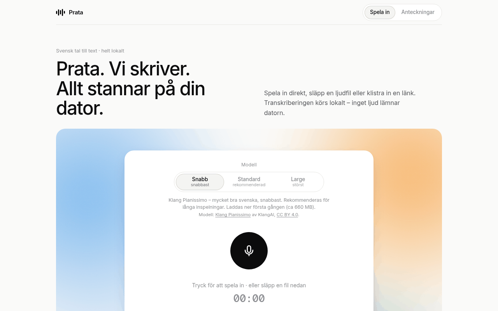

# Prata

> **Svenska:** Prata är en lokal app för svensk tal-till-text. Spela in direkt i webbläsaren eller släpp en ljudfil – texten kommer med tidsstämplar och kan laddas ner som .txt, .srt eller .json. Allt körs på din egen dator; inget ljud lämnar den. Starta med `npx prata-app`.

Prata is a local, private Swedish speech-to-text app. It runs the Swedish
[KB-Whisper](https://huggingface.co/KBLab/kb-whisper-large) models from the National Library of Sweden (KBLab)
with [Hugging Face Candle](https://github.com/huggingface/candle) (Metal GPU on Apple Silicon) and
serves a small web UI on `127.0.0.1`. For long recordings there is an optional fast model, **Snabb**
([Klang Pianissimo](https://huggingface.co/KlangAI/pianissimo-sv) by KlangAI, CC BY 4.0), run on the CPU with ONNX Runtime.



- Record from the microphone or upload a file (wav, mp3, m4a, ogg, flac, opus, webm, mp4 – anything ffmpeg reads)
- **Transcribe from a link:** paste a YouTube/SVT Play/podcast page (needs [yt-dlp](#transcribe-from-a-link)) or a direct link to an audio/video file
- Transcript with segment timestamps, a waveform player, click-to-seek timestamps, search and copy
- Downloads: `.txt`, `.txt` with timestamps, `.srt` subtitles, `.json`
- Three models in the UI – **Snabb**, **Standard** (default) and **Large** – plus a hint to use Snabb for recordings over 15 minutes; light and dark mode
- **Notes:** every transcription is saved (text + original audio) and listed by day, with search across all notes, rename and delete
- Phone-friendly: one big record button, installable to the iPhone Home Screen, reachable from your phone over [Tailscale](#use-it-from-your-iphone-tailscale)
- Also a command-line tool: `prata interview.m4a --timestamps`

## Quick start

```bash
# macOS
brew install ffmpeg
brew install yt-dlp     # optional: transcribe YouTube and other web pages
npx prata-app
```

On Linux install ffmpeg with `sudo apt install ffmpeg` (or your distro's package) first.
The Linux x64 binaries need **glibc 2.39 or newer** (Ubuntu 24.04+, Debian 13+, Fedora 40+ and similar); the
launcher says so in Swedish and stops on older systems. On Ubuntu 22.04 use 0.5.1 (`npx prata-app@0.5.1`, no Snabb)
or build from source.

`npx prata-app` downloads the prebuilt binaries for your platform (macOS Apple Silicon, macOS Intel, Linux x64)
from this repository's GitHub Release into `~/.prata/<version>/`, starts the server on a free port
(8795 if available) and opens your browser. Press **Ctrl+C** to stop. The first transcription with a
model downloads its weights from Hugging Face into `~/.cache/huggingface/`.

Options: `npx prata-app --port 9000 --no-open --model snabb`. `--model` sets the default model (`PRATA_MODEL`): `snabb`,
`small` or `large` preselect that button in the UI; `tiny`, `base` and `medium` are only used as the default for HTTP API
jobs that don't name a model (the UI then preselects Standard). See [npm/README.md](npm/README.md).

## Models

The web UI offers three models (the CLI and HTTP API also accept `tiny`, `base` and `medium`, see below):

| In the UI | Model | Description (as shown) |
|---|---|---|
| **Snabb** | Klang Pianissimo (`snabb`) | Klang Pianissimo – mycket bra svenska, snabbast. Rekommenderas för långa inspelningar |
| **Standard** (default) | KB-Whisper small (`small`) | Bästa balansen mellan kvalitet och tid |
| **Large** | KB-Whisper large (`large`) | Största modellen, långsammast |

`tiny`, `base` and `medium` are hidden in the UI but remain available via the CLI (`--model tiny`), the HTTP API
(`"model": "medium"`) and `PRATA_MODEL`. Standard stays preselected and Prata never switches models by itself.

**Long-recording hint.** When a file or recording is longer than 15 minutes and a model other than Snabb is selected,
the UI asks the server (`GET /api/model-hint?duration_s=…&model=…`) and shows a small hint
(“Lång inspelning – Snabb går betydligt fortare. Byt till Snabb”). It switches to Snabb only when you click it.
The rule lives on the server (`crates/prata-web/src/hint.rs`); there is no hint when this build has no Snabb or the
duration is unknown.

Speed and accuracy of Prata 0.6.1 on three Swedish recordings: long12 (12.5 min), clip (2.5 min) and clip15 (15 s).
The measurements were made on a **Linux x86_64 machine** (KVM guest, Intel Xeon of the Sapphire Rapids class, 8 vCPU,
15 GB RAM, **CPU only, no GPU**) with default settings. Snabb ran int8 with `--threads 4` and 30 s windows with 5 s of
context; KB-Whisper ran on the CPU through Candle. The time is the wall time of one `prata` run including model
loading, with the model already downloaded. The machine was shared, so times are ±15 %. The peak memory is the peak
RSS of the `prata` process. The Mac column shows a Mac mini M4 (24 GB). Snabb runs on the CPU there too (ONNX
Runtime), while KB-Whisper uses Metal. On the Mac the memory figure is the peak memory footprint, which for
KB-Whisper includes the Metal (GPU) buffers.

WER is scored with Prata's Swedish normalisation (lowercase, punctuation removed, Swedish number words and digits
compare equal, hyphens unified). The first WER column uses the original reference text. That text comes from a 2010
article, and the reader doesn't follow it word for word in a few places. The second column uses a reference corrected
for those places.

**long12 (12.5 min)**

| Model | Time (x86 CPU) | Peak memory (x86 CPU) | WER | WER (corrected ref) | Mac mini M4 | Notes |
|---|---:|---:|---:|---:|---|---|
| **Snabb** (Klang Pianissimo, ONNX int8) | 40 s | 2.1 GB | 5.3 % | 3.0 % | 23.9 s wall time (21.7 s transcription), 2.2 GB² | fastest, about 19× faster than Standard here; recommended for long recordings |
| **Standard** (KB-Whisper small) | 576 s | 1.9 GB | 4.3 % | 2.1 % | 133.7 s, 4.9 GB peak footprint (Metal) | **default** |
| **Large** (KB-Whisper large) | not timed (about 30 min on this CPU) | 9.5 GB¹ | 4.6 % | 2.4 % | not measured (clip: 119.5 s, 11.7 GB peak footprint, Metal) | largest, slowest; needs a 16 GB+ Mac |

¹ Large's peak memory was measured on the 2.5-minute clip with the CPU build (f32). It is much lower on Metal. Large's
long12 WER comes from a Mac Metal run. Where both runs exist, KB-Whisper's output is byte-identical on the x86 CPU
build and on Metal, so the WER figures hold for both machines.

² Snabb on the Mac mini M4: the 2.5-minute clip takes 4.2 s with a 1.8 GB peak. The first run, on clip15 (15 s) and
including the download of the model, took 28.5 s. The model takes about 660 MB (630 MiB) in the Hugging Face cache.

**WER per recording** (original reference, corrected reference in brackets; time on x86 CPU)

| Recording | Snabb | Standard | Large |
|---|---|---|---|
| clip15 (15 s) | 5.56 % (5.56 %), 3.1 s | 2.78 % (2.78 %), 13.8 s | 0.00 % (0.00 %), 63.8 s |
| clip (2.5 min) | 5.14 % (2.87 %), 9.5 s | 4.29 % (2.01 %), 117.7 s | 4.00 % (1.72 %), 555.9 s |
| long12 (12.5 min) | 5.26 % (2.99 %), 40.1 s | 4.34 % (2.07 %), 576.1 s | 4.63 % (2.36 %), not timed |

Earlier, before the 0.6.1 Snabb fixes and with an older WER normalisation, a Mac mini M4 transcribed long12 in about
19 s with Snabb, 132 s with Standard and 595 s with Large. Those figures are from that earlier evaluation, not final
0.6.1 results.

One recording is not a general accuracy figure; see the model cards for benchmark WERs.
`scripts/bench-models.sh` reproduces the comparison on your own recordings.

### Snabb (Klang Pianissimo)

[Pianissimo](https://huggingface.co/KlangAI/pianissimo-sv) is a Swedish Parakeet TDT model by KlangAI. Prata runs
KlangAI's official int8 ONNX export, [KlangAI/pianissimo-sv-onnx](https://huggingface.co/KlangAI/pianissimo-sv-onnx),
unmodified, with ONNX Runtime on the CPU. Pianissimo is a fine-tune of NVIDIA Parakeet TDT 0.6B v3. It writes punctuation
and casing itself and gives sentence-level timestamps. Long audio is decoded in 30-second windows with overlapping
context on both sides.

- **First use:** the model files (about 660 MB = 630 MiB, the same size in the cache: `encoder-model.int8.onnx`,
  `decoder_joint-model.int8.onnx`, `vocab.txt`)
  are downloaded from Hugging Face into the normal cache (`~/.cache/huggingface/`, `HF_HOME` respected). The web UI
  shows the download progress; later runs start straight away.
- **Platforms:** macOS Apple Silicon and Linux x64 (glibc 2.39+, e.g. Ubuntu 24.04+; the prebuilt ONNX Runtime needs it). The macOS Intel build has no Snabb; the option is shown greyed out there.
- **CLI:** `prata recording.m4a --model snabb --timestamps` (`pianissimo`, `KlangAI/pianissimo-sv` and
  `KlangAI/pianissimo-sv-onnx` are accepted too). The model revision is pinned to the one this version was tested with.
- **No Python fallback:** if the build has no Snabb, a Snabb job fails with a Swedish message. It does not silently
  run another model.
- **License:** CC BY 4.0, © KlangAI – see [Credits and licenses](#credits-and-licenses).

### KB-Whisper sizes

Measured on an Apple Silicon (M-series) Mac with the Metal build, transcribing 2 min 28 s of Swedish speech:

| Model | Time | Peak memory | Notes |
|---|---:|---:|---|
| tiny | 6 s | 0.7 GB | fastest, rough |
| base | 10 s | 1.0 GB | |
| **small** | **30 s** | **2.8 GB** | **default**: best speed/quality trade-off |
| medium | 80 s | 5.8 GB | |
| large | 137 s | 12.3 GB | largest, slowest; needs a 16 GB+ Mac |

On CPU (Linux x64 build) everything is several times slower; `small` runs at roughly real time on an 8-core machine.
For accuracy figures (WER) of each size see the [KB-Whisper model card](https://huggingface.co/KBLab/kb-whisper-large).

## Privacy

Everything runs locally. Audio is uploaded only to the Prata server on your own machine (`127.0.0.1`),
converted with your local ffmpeg and transcribed. The transcript and the original audio are saved as a note in
`~/.prata/notes/` (see [Notes](#notes)); the temporary converted files are deleted.
The only network access is downloading the model weights from Hugging Face on first use,
the one-time binary download when you use `npx prata-app`, and – only when you paste a link – downloading that
link's audio, and – only when you set `KLANG_API_KEY` and press **Synka från Klang** – reading your conversations
from Klang (see [Import from Klang](#import-from-klang)). There is no telemetry.

## Build from source

Requirements: Rust (stable, ≥ 1.88), ffmpeg on `PATH`. On macOS: Xcode command line tools.

```bash
git clone https://github.com/Malmen877/prata.git && cd prata

# macOS, Apple Silicon (Metal GPU)
cargo build --release -p prata --features metal
cargo build --release -p prata-web

# Linux / CPU
cargo build --release

./target/release/prata-web            # http://127.0.0.1:8795
./target/release/prata recording.m4a --model small --timestamps
```

Tests: `cargo test --release --workspace`. The link tests run against a local mock HTTP server; the real-yt-dlp
test is skipped when yt-dlp isn't installed. The `insecure-test-loopback` cargo feature (plus
`PRATA_INSECURE_ALLOW_LOOPBACK=1`) lets a *test build* download from 127.0.0.1 for browser end-to-end tests –
never build releases with it.

`prata-web` looks for the `prata` binary next to itself (so a workspace build or a release
archive just works), then `$PRATA_BIN`, then `$PATH`.

Package a release archive the same way CI does:

```bash
scripts/package.sh darwin-arm64        # → dist/prata-v<version>-darwin-arm64.tar.gz (+ .sha256)
PRATA_LOCAL_ASSET=$PWD/dist/prata-v0.6.1-darwin-arm64.tar.gz node npm/bin/prata.js
```

### Repository layout

```
crates/prata/       CLI (Candle whisper decoder, forced Swedish, 30 s windows, SRT output)
                    src/snabb/: Snabb engine (Klang Pianissimo via onnxruntime; `snabb` cargo feature)
crates/prata-web/   axum web server + single-file UI (src/index.html) and PWA icons (src/assets/), embedded in the binary
                    notes storage in src/notes.rs, link downloads (SSRF checks, yt-dlp) in src/fetch.rs,
                    Klang import in src/klang.rs, long-recording hint in src/hint.rs
python/             optional Python fallback backend (transformers), requirements.txt
npm/                `prata-app` launcher (pure Node, no dependencies)
scripts/package.sh  builds the release tar.gz
scripts/bench-models.sh, wer_sv.py  model comparison (time, peak memory, WER)
scripts/test-ui.mjs unit test for the UI's day grouping: `TZ=Europe/Stockholm node scripts/test-ui.mjs`
.github/workflows/  CI and tag-triggered release (GitHub Release assets + optional npm publish)
```

## CLI

```
prata <AUDIO> [--model tiny|base|small|medium|large|snabb|<hf repo id>] [--timestamps] [--out FILE]
              [--revision main|strict|subtitle] [--language sv] [--cpu]
              [--kv-cache on|off] [--vad on|off] [--vad-min-silence S] [--vad-pad S]
              [--vad-threshold DB] [--batch-size N] [--pack] [--verbose]
```

Without `--timestamps` it prints plain text; with it, SRT. `--cpu` forces CPU on a Metal/CUDA build. The CLI's default
model is `large` (the web UI's is `small`). `prata --help` ends with a line saying whether this build includes Snabb.
The VAD options below apply to all models; `--batch-size`, `--pack` and `--kv-cache` apply to KB-Whisper only.

### Speed options

| Flag | Default | What it does |
|---|---|---|
| `--kv-cache on\|off` | `on` | Caches the decoder's self-attention keys/values, so each new token costs one layer pass instead of re-running the whole sequence. Same computation, same output (byte-identical SRT in our tests), ~1.6–1.9× faster on CPU. |
| `--vad on\|off` | `on` | Energy-based voice activity detection. Pauses of at least `--vad-min-silence` seconds (default `1.0`) are skipped, keeping `--vad-pad` seconds (default `0.3`) of audio on each side of speech. Each speech region is decoded with the normal sequential decoder, and no 30 s window reaches across a skipped pause. Timestamps always refer to the original file. If no pause is long enough, the result is exactly the same as `--vad off`. `--vad-threshold DB` overrides the automatic speech threshold (dB above the noise floor). |
| `--batch-size N` | `0` = auto (4 on Metal/CUDA, 1 on CPU) | Encodes and decodes the current windows of up to N speech regions together. Within a region the windows are the same as the sequential decoder's. This only helps when VAD found several regions. |
| `--pack` | off | **Experimental.** Packs speech into fixed windows of up to 30 s, cut at quiet points, so that continuous speech can be batched too. About 1.5× faster again on CPU with `--batch-size 4`, but the window borders differ from the sequential decoder, so some words come out differently (4% word difference on a 2.5-minute test clip). |
| `--verbose` | | Prints the VAD regions or window plan. |

`scripts/bench.sh AUDIO [MODELS…]` times the configurations and reports RTF, peak memory, and WER against the baseline (`scripts/wer.py`). It works on macOS and Linux.

`scripts/bench-models.sh --audio DIR|FILE --refs DIR [--models "snabb small large"]` compares models against reference
transcripts: wall time, peak memory and WER (Swedish normalisation in `scripts/wer_sv.py`). It works in a fresh
`mktemp -d` folder and calls the `prata` CLI directly, so a running Prata server is not touched. Usage is at the top of the script.

## Web server configuration

```
prata-web [--host ADDR] [--port PORT] [--notes-dir DIR]
          [--url-max-mb MB] [--url-max-duration DUR] [--url-timeout DUR] [--yt-dlp PATH]
```

Flags override the environment variables below. `PRATA_*` is the primary name; the older `KBW_*` names still work.

| Variable | Default | Meaning |
|---|---|---|
| `PRATA_WEB_PORT` | `8795` | listen port |
| `PRATA_WEB_HOST` / `PRATA_HOST` | `127.0.0.1` | listen address (`--host`). Keep it local – there is no authentication; prata-web prints a warning for any non-loopback address |
| `PRATA_NOTES_DIR` | `~/.prata/notes` | where notes are saved (`--notes-dir`) |
| `PRATA_URL_MAX_MB` | `500` | size limit for links (`--url-max-mb`) |
| `PRATA_URL_MAX_DURATION` | `3h` | duration limit for links, e.g. `3h`, `90m`, `5400` (`--url-max-duration`) |
| `PRATA_URL_TIMEOUT` | `15m` | overall download timeout for links (`--url-timeout`) |
| `PRATA_YTDLP` | `yt-dlp` on `$PATH` | yt-dlp binary (`--yt-dlp`) |
| `PRATA_MODEL` | `small` | default model in the UI |
| `PRATA_BACKEND` | `auto` | `auto` (prata, falling back to Python), `prata`, or `python` |
| `PRATA_BIN` | next to `prata-web`, then `$PATH` | path to the `prata` CLI |
| `PRATA_ARGS` | inferred from `prata --help` | argument template, placeholders `{input}` `{model}` `{out}` |
| `PRATA_PYTHON` | `python3` | interpreter for the Python fallback |
| `PRATA_PYTHON_SCRIPT` | `transcribe.py` next to the binary, or `python/transcribe.py` | Python fallback script |
| `PRATA_WORK_DIR` | `$TMPDIR/prata-web` | temporary upload directory |
| `PRATA_MAX_UPLOAD_MB` | `1024` | upload size limit |
| `PRATA_VAD` | unset (CLI default `on`) | passed as `--vad` (`on`/`off`) |
| `PRATA_BATCH_SIZE` | unset (CLI default auto) | passed as `--batch-size` |
| `KLANG_API_KEY` | unset | enables the [Klang import](#import-from-klang) (`PRATA_KLANG_API_KEY` also works) |
| `PRATA_KLANG_BASE_URL` | `https://app.klang.ai/api/v1` | Klang API base (for tests against a mock; `http` only for `127.0.0.1`) |

HTTP API: `POST /api/jobs` (multipart `file`, `model`) → `{id}`; `POST /api/jobs/url` (`{"url": "…", "model": "small"}`)
→ `{id}` or `400 {error}` for an invalid/blocked link; `GET /api/jobs/{id}` (status `downloading|queued|converting|running|done|error`,
`download_pct`, segments, `note_id` when done, `error_user` with a readable message);
`GET /api/jobs/{id}/{txt|txt-ts|srt|json}`; `GET /api/info` (includes `version`, `default_model` and `models`: id, label,
description, availability, download size, whether it's downloaded, license); `GET /api/model-hint?duration_s=S&model=M`
(`{suggest: "snabb"|null, reason}`); `GET /api/health` (`{ok, prata, ffmpeg, yt_dlp: {available, version}}`).

Notes API: `GET /api/notes?q=` (newest first, `{notes, total}`; every search word must occur in the title, transcript or summary),
`GET /api/notes/{id}`, `PATCH /api/notes/{id}` with `{"title": "…"}`, `DELETE /api/notes/{id}` (removes the audio too),
`GET /api/notes/{id}/audio` (original audio, supports `Range` for seeking), `GET /api/notes/{id}/{txt|txt-ts|srt|json}`.

Klang API (only when enabled, else `404`): `POST /api/klang/sync` starts a sync – or joins the one already running –
and answers `202 {running, started_at, last}`; `GET /api/klang/sync` → `{enabled, running, last: {new, updated,
unchanged, skipped, deleted_here, error, message, finished_at}}` (`skipped` = could not be imported,
`deleted_here` = deleted in Prata earlier). `GET /api/info` has `klang_enabled` (never the key).

### Notes

Every finished transcription is stored as a folder per note:

```
~/.prata/notes/<id>/note.json     title, created (unix time), model, audio duration, segments with timestamps,
                                  source_url (only for notes made from a link); Klang imports also have
                                  source "klang", summary, klang {id, updated_at} and title_edited
~/.prata/notes/<id>/audio.<ext>   the original upload or recording (m4a from iPhone, webm from Chrome, …)
```

The default title is the local date and time plus the first words of the transcript; rename it in the UI.
Writes are atomic (temporary file + fsync + rename), so a crash never leaves a half-written note, and the folder is
plain files: back it up with Time Machine, copy it to another Mac, or delete a folder to remove a note.
The list is grouped by day (Idag, Igår, 28 september, …) using the browser's local time.

### Transcribe from a link

Paste a link in **Klistra in länk** under the record button. Prata downloads the audio on the Mac, then
transcribes it like an upload; the note keeps the downloaded audio, gets the video/episode title as its name and
links back to the source.

- **Direct links** to audio/video files (`.mp3`, `.m4a`, `.mp4`, `.wav`, …) work out of the box.
  The note is named after the file (from `Content-Disposition` if the server sends one, else the last part of
  the URL, without extension, `_` as spaces); generic names like `download.mp3` keep the default date title.
- **Web pages** (YouTube, SVT Play, Vimeo, most podcast pages, …) need [yt-dlp](https://github.com/yt-dlp/yt-dlp):
  `brew install yt-dlp` (keep it updated with `brew upgrade yt-dlp`; sites change often). Prata finds it on `PATH`
  (set `PATH` in the LaunchAgent, see below) or via `PRATA_YTDLP`, and picks it up without a restart.
  Without it the UI shows a hint and direct links still work.
- Limits: 500 MB, 3 hours of audio and a 15 minute download timeout by default (see the table above).
  Live streams, private videos and pages that need a login are refused with a message.

**Security.** Links are fetched by the Mac, so Prata refuses anything that is not a public internet address:
only `http`/`https`, no `user:password@` links, and every address the host resolves to must be public –
loopback, private (10/8, 172.16/12, 192.168/16), CGNAT/Tailscale (100.64/10), link-local (169.254/16, incl. cloud
metadata), IPv6 unique-local/link-local, multicast, unspecified and IPv4-mapped/NAT64/6to4 forms of those are blocked.
The check runs on the resolved addresses inside the HTTP client (the address that was checked is the one connected
to, so DNS rebinding does not help), again on every redirect (at most 5), and no proxy settings are taken from the
environment. yt-dlp is started without a shell, with the link as a single argument after `--`, `--ignore-config`,
no plugins, no `--exec`, playlists off, size and duration filters, and its output must stay inside the job's temp
folder. Note that yt-dlp itself fetches the media URLs the site points to; Prata checks the link you pasted
(and its redirects) but not those secondary requests. Anyone who can reach your Prata can make the Mac download
things, so keep it on `127.0.0.1` + `tailscale serve` as described below.

### Import from Klang

If you also record meetings with [Klang](https://klang.ai), Prata can import them as notes (read-only – nothing
is ever written to Klang, and no audio is downloaded). Create an API key in Klang and start prata-web with it:

```sh
KLANG_API_KEY=sk_… prata-web          # or add it to the LaunchAgent's EnvironmentVariables
```

The Notes list then shows **Synka från Klang**. A sync reads all ready conversations (following `next_cursor`
while `has_more`, 100 per page) and reports e.g. *Klang: 2 nya, 1 uppdaterad, 14 oförändrade.* (plus
*N hoppades över* only when something could not be imported).
Imported notes appear in the same day groups with a small **Klang** label and show Klang's summary (Markdown,
rendered as plain formatted text – raw HTML is never inserted) above the speaker-labeled transcript. They have no
player and no `.srt`; `.txt` and `.json` work, and `.txt med tider` when the transcript has timestamps.
The `.txt` exports start with the summary as plain text (headings, bullets, links as text), then `----` and the
transcript (in `.txt`, one speaker turn per paragraph).

How re-syncs behave:

- **Dedupe:** a note remembers its Klang conversation id (`klang.id` in `note.json`, folder `klang-<id>`);
  syncing again never creates a second copy, also after a restart.
- **Updates:** conversations whose `updated_at` hasn't changed are skipped without fetching them again.
  Otherwise Prata fetches it and updates the note if the title, summary, transcript or date changed.
  If you renamed the note in Prata, your title is kept; everything else follows Klang.
- **Titles:** Klang's title when it has a real one. Untitled conversations (Klang calls them e.g. *30 sep. 10:51*)
  get a title from the summary – its first specific heading (not *Sammanfattning*, *Beslut* …), else its first
  sentence – then the digest, then the first words of the transcript (without timestamps and *Talare 1:* labels),
  and only last the date. Markdown is stripped and long titles are cut at a word with *…* (about 60 characters).
  `title_source` in `note.json` records where it came from (`klang`, `summary`, `digest`, `transcript`, `date`,
  `user`). Automatic titles are refreshed on every sync from the locally stored summary/transcript – no extra
  API calls – so notes imported by older versions get the better title on the next sync. Renamed notes
  (`title_edited`) are never touched.
- **Deleted here stays deleted:** deleting an imported note adds its Klang id to `.klang-deleted.json` in the notes
  folder, and later syncs skip it (not counted in the message). To get it back, remove the id from that file (or delete the
  file) and sync again.
- Only conversations with status `ready` are listed and imported; pending/failed ones are ignored until they're ready.
- **Date:** Klang's `created_at` (`started_at` if Klang ever sends it), else `updated_at`, else the import time.
- **Transcript:** lines like `[00:01:02] Ada: …` become timestamped segments; transcripts without timestamps
  are shown one line per speaker turn without times.
- **Limits and errors:** only one sync runs at a time. Klang's free plan allows 50 API calls per day (one per page
  plus one per new or changed conversation). On HTTP 429 Prata waits `Retry-After` (up to 60 s, 3 retries);
  longer waits stop the sync with *försök igen om …*. 5xx and network errors are retried briefly. A wrong key
  shows *Ogiltig Klang-nyckel*. Whatever was imported before an error is kept.
- **The key** is only sent in the `Authorization` header to the Klang API (no redirects are followed). It is never
  written to notes, logs, error messages or API responses (an integration test runs the server with a fake key
  and checks its stdout/stderr). Sync results are logged as `[klang] Klang: …` lines.

## Use it from your iPhone (Tailscale)

Run Prata on an always-on Mac (e.g. a Mac mini) and reach it from your iPhone over [Tailscale](https://tailscale.com).
`tailscale serve` gives you a real HTTPS address, which iOS Safari needs for the microphone, while prata-web keeps
listening on `127.0.0.1` only.

1. Install Tailscale on the Mac (`brew install --cask tailscale` or the App Store app) and on the iPhone (App Store),
   and sign in to the **same tailnet** on both.
2. In the [admin console](https://login.tailscale.com/admin/dns) enable **MagicDNS** and **HTTPS Certificates**.
3. Start Prata on the Mac (see the LaunchAgent below to keep it running), then publish it inside your tailnet:

   ```bash
   tailscale serve --bg 8795        # https://<machine>.<tailnet>.ts.net  ->  http://127.0.0.1:8795
   tailscale serve status           # shows the URL;  `tailscale serve reset` turns it off
   ```

   (With the Mac App Store app the CLI is `/Applications/Tailscale.app/Contents/MacOS/Tailscale`.)
4. On the iPhone open `https://<machine>.<tailnet>.ts.net` in Safari, allow the microphone, then
   **Share → Add to Home Screen**. It opens full screen like an app (name *Prata*).

Use `tailscale serve`, not `tailscale funnel`: funnel publishes to the whole internet.

**Security:** prata-web has no login. Anyone who can reach it can record, read, download and delete notes.
With `tailscale serve` that means every device and user in your tailnet (restrict it with Tailscale ACLs if you share
the tailnet). Binding to another address with `--host 0.0.0.0` exposes it to your whole LAN as well, and the
microphone will not work there without HTTPS – prefer the default `127.0.0.1` plus `tailscale serve`.

### Keep it running on macOS (LaunchAgent)

Save as `~/Library/LaunchAgents/se.prata.web.plist` (adjust the paths to where you built or installed Prata;
replace `kevin` with your user name):

```xml
<?xml version="1.0" encoding="UTF-8"?>
<!DOCTYPE plist PUBLIC "-//Apple//DTD PLIST 1.0//EN" "http://www.apple.com/DTDs/PropertyList-1.0.dtd">
<plist version="1.0">
<dict>
  <key>Label</key><string>se.prata.web</string>
  <key>ProgramArguments</key>
  <array>
    <string>/Users/kevin/prata/target/release/prata-web</string>
    <string>--port</string><string>8795</string>
  </array>
  <key>EnvironmentVariables</key>
  <dict>
    <!-- ffmpeg from Homebrew lives in /opt/homebrew/bin; launchd's default PATH does not include it -->
    <!-- … and so does yt-dlp (brew install yt-dlp) for links to web pages -->
    <key>PATH</key><string>/opt/homebrew/bin:/usr/local/bin:/usr/bin:/bin:/usr/sbin:/sbin</string>
    <key>PRATA_MODEL</key><string>small</string>
    <!-- optional Klang import; the key is then stored in this file: chmod 600 it -->
    <!-- <key>KLANG_API_KEY</key><string>sk_…</string> -->
  </dict>
  <key>WorkingDirectory</key><string>/Users/kevin</string>
  <key>RunAtLoad</key><true/>
  <key>KeepAlive</key><true/>
  <key>StandardOutPath</key><string>/Users/kevin/Library/Logs/prata-web.log</string>
  <key>StandardErrorPath</key><string>/Users/kevin/Library/Logs/prata-web.log</string>
</dict>
</plist>
```

```bash
plutil -lint ~/Library/LaunchAgents/se.prata.web.plist
launchctl bootstrap gui/$(id -u) ~/Library/LaunchAgents/se.prata.web.plist     # start now and at every login
launchctl kickstart -k gui/$(id -u)/se.prata.web                              # restart (e.g. after rebuilding)
launchctl bootout gui/$(id -u)/se.prata.web                                   # stop and unload
tail -f ~/Library/Logs/prata-web.log
```

A LaunchAgent runs while your user is logged in; for a headless Mac mini enable automatic login
(System Settings → Users & Groups) and disable sleep (System Settings → Energy → "Prevent automatic sleeping").

### Python fallback (optional)

If the `prata` binary is missing or fails, `prata-web` can use `python/transcribe.py`
(Hugging Face transformers). It is not needed for normal use.

```bash
python3 -m venv .venv && . .venv/bin/activate
pip install -r python/requirements.txt
python3 python/transcribe.py recording.m4a --model small --timestamps
```

## Limitations

- Jobs run one at a time. A job that is still running when the server stops is lost; finished ones are saved as notes.
- Long recordings are kept in browser memory until you press stop.
- A word can occasionally be dropped or repeated at a 30-second window boundary (both KB-Whisper and Snabb decode in windows).
- Snabb is not available in the macOS Intel build.
- The microphone needs a secure context: use `http://127.0.0.1`/`localhost` on the Mac, or HTTPS (e.g. `tailscale serve`) from other devices – not a plain LAN IP.

## Credits and licenses

Prata's own code is released under the [MIT License](LICENSE) © 2026 Kevin Malmgren. See [NOTICE](NOTICE).

- **KB-Whisper** by [KBLab](https://huggingface.co/KBLab), National Library of Sweden – models
  `KBLab/kb-whisper-{tiny,base,small,medium,large}`, **Apache-2.0** (per the model cards). Weights are downloaded
  from Hugging Face at runtime and are not redistributed here. Please cite: Vesterbacka et al. (2025),
  *Swedish Whispers; Leveraging a Massive Speech Corpus for Swedish Speech Recognition*, Interspeech 2025.
- **Klang Pianissimo** (“Snabb”) by [KlangAI](https://huggingface.co/KlangAI) – model
  [KlangAI/pianissimo-sv](https://huggingface.co/KlangAI/pianissimo-sv), licensed
  [**CC BY 4.0**](https://creativecommons.org/licenses/by/4.0/). Prata uses KlangAI's official ONNX export
  [KlangAI/pianissimo-sv-onnx](https://huggingface.co/KlangAI/pianissimo-sv-onnx) without changes. The files are
  downloaded from Hugging Face at runtime and are not redistributed here. Pianissimo is a fine-tune of
  [NVIDIA Parakeet TDT 0.6B v3](https://huggingface.co/nvidia/parakeet-tdt-0.6b-v3) (CC BY 4.0).
- **onnx-asr** (MIT) / **NVIDIA NeMo** (Apache-2.0): Snabb's log-mel front end follows onnx-asr's NeMo preprocessor, and
  `crates/prata/src/snabb/nemo128fb.bytes` holds its 128-band (librosa Slaney) mel filter bank.
- **ONNX Runtime** (via the `ort` crate) – MIT; linked into builds with Snabb.
- **Hugging Face Candle** – Apache-2.0 / MIT. The CLI is derived from Candle's whisper example.
- **OpenAI Whisper** – MIT (code); model architecture, decoding rules and mel filters.
- **ffmpeg** is used at runtime and installed separately.

Prata is an independent project and is not affiliated with KBLab, KlangAI, NVIDIA, Hugging Face or OpenAI.
